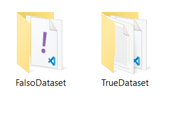
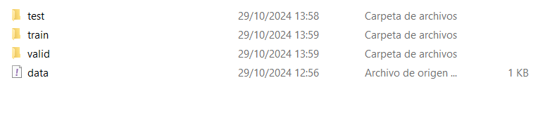
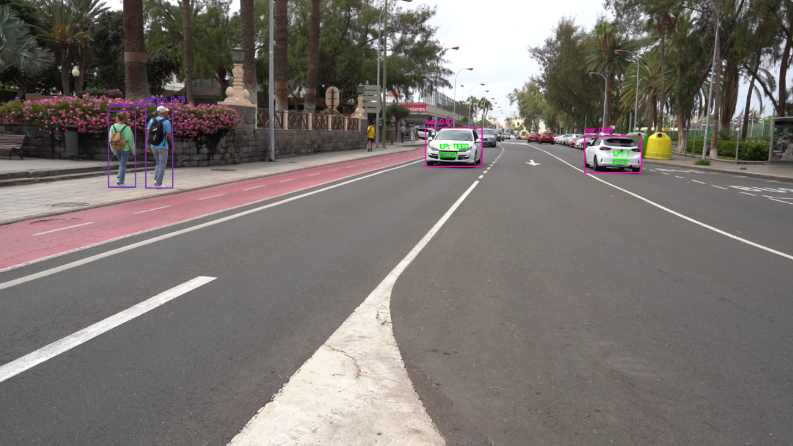

# Cuaderno 4 

Este Cuaderno muestra el desarrollo del cuarto cuaderno de la asignatura, el cual incluye un único ejercicios.

### Pasos Previos

Antes de si quieras empezar hay que seccionarte de tener disponible 2 apartados fundamentales:

* Un entorno virtual creado con Python, opencv-python y matplotlib instalado (En este cuaderno se utilizará Anaconda)
* Un dataset en concreto para el trabajado de datos, no esta aquí por espacios pero este se encuentra en Dataset/TrueDataset/data.yaml y se entra y descarga lo que hay en al archivo url

Si se quiere acceder al video resultado o al csv, puedes acceder desde estos enlaces

- https://alumnosulpgc-my.sharepoint.com/:v:/g/personal/mario_perez114_alu_ulpgc_es/ETtLf8toga1CqPv1WoJ45W4BoQaS2OfUL00cVnSVVd5SLQ?nav=eyJyZWZlcnJhbEluZm8iOnsicmVmZXJyYWxBcHAiOiJPbmVEcml2ZUZvckJ1c2luZXNzIiwicmVmZXJyYWxBcHBQbGF0Zm9ybSI6IldlYiIsInJlZmVycmFsTW9kZSI6InZpZXciLCJyZWZlcnJhbFZpZXciOiJNeUZpbGVzTGlua0NvcHkifX0&e=2zRo58  
- https://alumnosulpgc-my.sharepoint.com/:x:/g/personal/mario_perez114_alu_ulpgc_es/ESknjYEvLD9NoPsE_i9bS9QB7DUiCBSQnVl1IqCeX4sx9w?e=aNeIgU

### Desarrollo

Para empezar dentro de nuestro cuadernos tendremos unas librerías instaladas:

```python
import cv2  

import pytesseract 
from pytesseract import Output

from collections import defaultdict
import numpy as np

import torch
from ultralytics import YOLO
```
 
* **OpenCV (cv2)**: Se utiliza para la captura y procesamiento de imágenes y video en tiempo real. En el cuaderno se usará para capturar videos de la cámara web y añadir figuras sobre fotogramas. Es la librería principal de tratamiento de Fotogramas

* **NumPy (np)**: Proporciona estructuras de datos eficientes. En el cuaderno se usa para manipular datos de las imágenes y es una opción para crear un collage.

* **pytesseract**: Es una interfaz para el motor OCR de Tesseract, que permite convertir texto en imágenes a texto editable. En este cuaderno se utiliza para reconocer texto dentro de los fotogramas, específicamente para detectar y extraer el contenido de las matrículas.

* **Output (de pytesseract)**: Es una clase que permite obtener la salida de Pytesseract en un formato estructurado, como un diccionario, que incluye las coordenadas de los caracteres detectados y sus niveles de confianza.

* **collections.defaultdict**: Una estructura de datos que actúa como un diccionario, pero que permite especificar un valor predeterminado para las claves inexistentes. En este cuaderno se utiliza para almacenar y organizar información sobre los objetos detectados en diferentes fotogramas, permitiendo un acceso eficiente.

* **torch**: Es una librería principal para el cálculo numérico y la construcción de modelos de aprendizaje profundo, utilizada comúnmente en visión por computador y procesamiento de imágenes. En este cuaderno, se usa para gestionar y cargar modelos de detección preentrenados en YOLO.

* **ultralytics.YOLO**: Es una implementación del modelo YOLO (You Only Look Once) para la detección de objetos en tiempo real. En este cuaderno se utiliza para detectar vehículos y otros objetos en los fotogramas capturados, permitiendo identificar matrículas y otros elementos en movimiento.

* **pandas**: Proporciona estructuras de datos de alto rendimiento para manejar y manipular datos de forma eficiente en Python. En este proyecto, se utiliza para crear y gestionar un DataFrame que almacena y organiza la información recolectada (como las detecciones de objetos), que luego puede exportarse a un archivo .xlsx o .csv.

* **openpyxl import load_workbook**: Permite cargar archivos de Excel (.xlsx) en Python. Esto permite abrir y modificar un archivo de Excel existente sin sobrescribirlo, permitiendo agregar o actualizar datos sin perder información previa.

* **openpyxl.styles import PatternFill**: Utilizada para aplicar estilos de color en celdas de Excel. En este proyecto, se utiliza para asignar colores distintos a cada columna en el archivo de Excel, mejorando la visualización de los datos y facilitando su lectura.

Una vez están esas librerías instaladas, se puede empezar por las propias tareas

#### Tarea Unica - Conseguir crear un modo aplicable de YOLO

Esta tareas es enorme, es por ello que ahora más que nunca hace falta dividir el trabajo. Lo que se pide es con un video de una carretera pasando coches, personas, y alguna moto más bicicletas, en dicho video se debe crear el mismo video pero detectando todos los vehiculos y personas en el, más tener la capacidad de detectar también sus matriculas y lo que esta escrito en ellas.

Para esta tarea se va a dividir en 4 apartados

* Preparar el dataset con la información a trabajar
* Entrenar un nuevo modelo
* Preparar la salidad
* Realizar la detección

Vamos a ir punto por punto y mencionando lo importante de cada apartado

##### Preparar el dataset

Para poder detectar cada cosa se va a utilizar YOLO, por suerte YOLO vienen con unos modelos preentrenados para poder realizar la mayoría de detecciones, pero falta una, las matriculas.

Por ello se necesita un dataset que muestre varias matriculas que permita entrenar al modelo.

Para ello se ha conseguido un dataset sacado de RoboFlow con 7000 matriculas para el entrenamiento, 2000 para las validaciones y 1000 para el testeo además de estar ya estar todas con sus etiquetas.

Desgraciadamente esto genera un nuevo problema y es limitaciones de hardware, esto se explorar mejor en el siguiente apartado pero lo importante para este es que se disponen de demasiadas imagenes, para solucionar esto se dispone de una función nueva.

```python
def sample_images_with_labels(src_image_folder, src_label_folder, dest_image_folder, dest_label_folder, sample_percentage=0.2):
```
La idea de esta función es coger el dataset (el cual se le pasa la ruta como información) y crear una nuevas carpetas con el 20% de las imagenes cogidas de forma aleatoria. 

Quedan con una composición así

<div align="center">
    
</div>

<div align="center">
    
</div>

El archivo data.yaml que se ve ahí es un archivo que se necesitará para el siguiente apartado, la explicación del archivo es aquel que tiene la información importante para el modelo.


```yaml
train: E:\Escritorio\Universidad\5.- Quinto Año\Primer Cuatrimestre\Vision de los Computadores\Practica\Practica 4\Entregable\Dataset\FalsoDataset\train\images
val: E:\Escritorio\Universidad\5.- Quinto Año\Primer Cuatrimestre\Vision de los Computadores\Practica\Practica 4\Entregable\Dataset\FalsoDataset\valid\images
test: E:\Escritorio\Universidad\5.- Quinto Año\Primer Cuatrimestre\Vision de los Computadores\Practica\Practica 4\Entregable\Dataset\FalsoDataset\test\images

nc: 1
names: ['License_Plate']

roboflow:
  workspace: roboflow-universe-projects
  project: license-plate-recognition-rxg4e
  version: 6
  license: CC BY 4.0
  url: https://universe.roboflow.com/roboflow-universe-projects/license-plate-recognition-rxg4e/dataset/6
```

Teniendo las rutas donde estan las imagenes, sus "etiquetas" que en este caso son las matriculas y información de donde viene el dataset original.

Por ultimo, el ultimo valor dado por a la función que es un 0.2, es el porcentaje de imagenes cogidas, ya que esto es modificable.

##### Entrenar el modelo

Entrando un poco más en lo importante, se tiene el segundo codigo del cuaderno, este se basa en entrenar el modelo.

```python
model = YOLO('yolo11n.pt')

model.train(data = 'Dataset/FalsoDataset/data.yaml',
            imgsz = 640,  
            epochs = 30,  
            batch = 16, 
            name = 'yolo11_license_plate_detection',
            workers = 4)  

# Guardar el modelo entrenado
best_weights_path = model.export()
print(f"Modelo entrenado guardado en: {best_weights_path}")
```

Como se observa la respuesta de este "pequeño" codigo casi sextuplica al tamaño del propio codigo, vamos a desglozar esto.

Lo primero es cargar un modelo de YOLO nano prentrenado, se podría entrentar desde 0 pero es mucho más costoso a un nivel computacional. El motivo de usar un nano es que este es el empleado para elementos en pantalla en movimiento o en corto videos, lo cual es perfecto para este caso.

Luego esta el entrenamiento, este toma varios valores y empieza a entrenar para poder detectar matriculas. Los valores puesto son meramente a ojo, ya que estos son hiperparametros al fin de cuentas. Estos valores son:

* "Data": que es el propio archivo data que esta en el dataset
* "imgsz": que es el tamaño de cada imagen, cambiar este valor altera todas las imagenes y rescala cada imagen que se le pasa
* "epochs": que es el número de epocas por las que pasa el modelo, una epoca es por decirlo así como una sección de entrenamiento, entrena con todas las imagenes de entrenamiento y luego valida los resultados con las de validación, utilizando su conocimiento para la siguiente epoca
* "batch": que es número de lote que tiene el modelo, el lote es algo que utiliza el modelo para entrenar, ya que en vez de tomar todas las fotos de golpe las va tomando poco a poco en pequeñas cantidades o "lotes"
* "name": que es el nombre del modelo
* "workers": que es el número de nucleos que se utiliza para entrenar este modelo

Como ya se explico estos valores no tienen una forma de poner los valores correctos más que puro conocimiento previo, en este caso muchos de estos valores están puestos por limitación de hardware.

##### Preparar la salidad

Ahora toca "Preparar" la salidad del propio codigo, esto se refiere a lo que va a ser el codigo una vez terminado.

Aqui se van a hacer 3 cosas:

* Monstrar el video por pantalla 

<div align="center">
    
</div>

* Guardar dicho video modificado con las lineas en un mp4 sepado

```python
fourcc = cv2.VideoWriter_fourcc(*'mp4v')  
output_path = 'output_video.mp4'

fps = cap.get(cv2.CAP_PROP_FPS)
frame_width = int(cap.get(cv2.CAP_PROP_FRAME_WIDTH))
frame_height = int(cap.get(cv2.CAP_PROP_FRAME_HEIGHT))

out = cv2.VideoWriter(output_path, fourcc, fps, (frame_width, frame_height))


# Todo el codigo que pocresa y modifica el frame con los recuadros

out.write(frame)
```

* Y por ultimo, guardar los datos de cada fotograma en un archivo csv

```python
def save_to_excel(frame_number, label, confidence, x1, x2, y1, y2, plate_text):
```

Para ello se utilizará esta funcíon arriba del codigo final que cogera los datos que se le pasen y se guardarán dentro de un csv.

##### Realizar la detección

En el ultimo apartado, el cual es el más grande tenemos toda la parte para realizar las detecciones. 

Debido a ser tan grande el apartado vamos a volver a dividirlo en 4 apartados:

1. Parametros: Esto define los parametros iniciales del codigo, los cuales no son pocos. Disponemos de

    - El lugar de instalación de la librería pytesseract
    - Un modelo por defecto de YOLOv11 más el modelo entrenado anteriormente 
    - La ruta al video a analizar
    - Los umbrales de confianza y tamaño
 
    Como pequeña explicación, los umbrales es una caracteristica añadida por limitancia de hardware, basicamente el codigo ignorara cualquier detección que no este dentro de dichos umbrales que en este caso sería uno de confianza del 40% y otro de tamaño, teniendo un tamaño de 5500 para los coches y o autobuces y practicamente la mitad para el resto de etiquetas. 
    
    La diferncia de tamaño se justifica con que las personas, motos, y bicicletas son mucho más pequeñas que el resto de cosas en la imagen.

    Volviendo a repetir esto no afecta al codigo o resultado en casi nada, solamente es ppor limitancia de hardware

    La ultima función de esta parte es get_color_for_class() generá los colores de los cuadrados en la detección

2. Detección de valores prentrenados: Lo primeros será tomar un modolo normal de YOLOv11 para detectar las cosas por defecto. 

    Detectará los coches, personas, bicicletas, autobuses y motos. Tras detectar cada valor los pasa por los umbrales y entoces inicia el proceso de detectar las matriculas. 

    Una vez detecta ambas cosas las dibujas en el video 

```python
while cap.isOpened():
    ret, frame = cap.read()
    if not ret:
        break

    results = model_vehicles.track(source=frame, persist=True)
    for r in results:
        for box in r.boxes:
            x1, y1, x2, y2 = map(int, box.xyxy[0])
            cls = int(box.cls[0])

            conf = box.conf[0]
            label = model_vehicles.names[cls]
            area = (x2 - x1) * (y2 - y1)

            if label in ["car", "bus"]:
                if conf < CONF_THRESHOLD or area < SIZE_THRESHOLD_CARS:
                    continue
            else:
                if conf < CONF_THRESHOLD or area < SIZE_THRESHOLD_OTHERS:
                    continue
            
            plate_text = "-"

            if label in ["car", "motobicycle", "bus"]:
                vehicle_frame = frame[y1:y2, x1:x2]
                vehicle_frame_with_plate, plate_text = detect_license_plate(vehicle_frame)
                frame[y1:y2, x1:x2] = vehicle_frame_with_plate

            color = get_color_for_class(cls)
            cv2.rectangle(frame, (x1, y1), (x2, y2), color, 2)
            cv2.putText(frame, f'{label} {conf:.2f}', (x1, y1 - 10), cv2.FONT_HERSHEY_SIMPLEX, 0.5, color, 2)
```

3. Es la parte encargada de detectar las matriculas, para ello uiliza la función detect_license_plate(), la cual toma un frame sacado del momento en el que detecta un coche, bus, o moto.

    Una vez tiene el frame y aplica el modelo de detección de matriculas tras conseguir la matricula dibuja el cuadrado e intenta sacar el texto del frame de la propia matricula.
    
    Todo esto solo ocurre si el porcentaje de confianza supera el 40% 

```python
def detect_license_plate(vehicle_frame):

    plate_results = model_license_plate(vehicle_frame)
    plate_text = ""

    for r in plate_results:
        for box in r.boxes:

            x1, y1, x2, y2 = map(int, box.xyxy[0])
            conf = box.conf[0]
            if conf > 0.4:
                plate_frame = vehicle_frame[y1:y2, x1:x2]
                plate_text = extract_text_from_plate(plate_frame)
                label_text = f"LP: {plate_text}"

                cv2.rectangle(vehicle_frame, (x1, y1), (x2, y2), (0, 255, 0), 2)
                cv2.putText(vehicle_frame, label_text, (x1, y1 - 10), cv2.FONT_HERSHEY_SIMPLEX, 0.5, (0, 255, 0), 2)

    return vehicle_frame, plate_text
```

4. Por último, se tiene el apartado que utiliza la función extract_text_from_plate() para calcular el texto presente en una imagen de una matrícula capturada. Esta función se encarga de mejorar la legibilidad de la imagen mediante varios pasos de preprocesamiento antes de aplicar OCR con Pytesseract. A continuación, se explican los pasos de esta función:

- Ajuste de DPI: La imagen de la matrícula (plate_frame) se redimensiona para simular un DPI más alto, aumentando su claridad. El DPI base se establece en 72 y se escala a un DPI de 288. Esto se hace mediante un factor de escala calculado entre el DPI deseado y el DPI base, y luego aplicando cv2.resize() para aumentar el tamaño de la imagen.

    El DPI (Dots Per Inch) mide la cantidad de puntos por pulgada en una imagen, indicando su resolución y nivel de detalle. Para mejorar la precisión en OCR, se ajusta el DPI a un valor mayor, permitiendo que los caracteres sean más legibles. En este caso, se toma un DPI base de 72, que es un estándar común en pantallas, y se escala a 288 DPI (aproximadamente 4 veces mayor) para mejorar la claridad sin perder calidad, dado que 300 DPI suele ser ideal para el reconocimiento de texto.

- Conversión a Escala de Grises: La imagen redimensionada se convierte a escala de grises

- Ecualización de Histograma: Se aplica una ecualización de histograma a la imagen en escala de grises.

- Ajuste de Brillo y Contraste: Se realiza un ajuste adicional del brillo y el contraste utilizando un valor de contraste (alpha) de 1.5 y un valor de brillo (beta) de 50.

- Reducción de Ruido: La función aplica dilatación y erosión mediante un pequeño kernel para reducir el ruido que pueda interferir en la detección de caracteres. Estos pasos permiten definir mejor los bordes de los caracteres y eliminar posibles imperfecciones en la imagen.

- Reconocimiento de Texto con Pytesseract: Finalmente, la imagen procesada se pasa a Pytesseract usando la configuración --psm 7 --oem 3, que optimiza el OCR para reconocer una sola línea de texto y restringe los caracteres permitidos a letras mayúsculas y números mediante un whitelist (tessedit_char_whitelist=ABCDEFGHIJKLMNOPQRSTUVWXYZ0123456789).

```python
def extract_text_from_plate(plate_frame):
    base_dpi = 72
    target_dpi = 288

    scale_factor = target_dpi / base_dpi
    new_dimensions = (int(plate_frame.shape[1] * scale_factor), int(plate_frame.shape[0] * scale_factor))

    plate_frame = cv2.resize(plate_frame, new_dimensions, interpolation=cv2.INTER_CUBIC)

    gray_plate = cv2.cvtColor(plate_frame, cv2.COLOR_BGR2GRAY)

    gray_plate = cv2.equalizeHist(gray_plate)

    adjusted_plate = cv2.convertScaleAbs(gray_plate, alpha=1.5, beta=50)
    kernel = np.ones((1, 1), np.uint8)

    adjusted_plate = cv2.dilate(adjusted_plate, kernel, iterations=1)
    adjusted_plate = cv2.erode(adjusted_plate, kernel, iterations=1)

    custom_config = r'--psm 7 --oem 3 -c tessedit_char_whitelist=ABCDEFGHIJKLMNOPQRSTUVWXYZ0123456789'

    plate_text = pytesseract.image_to_string(adjusted_plate, config=custom_config).strip()
    return plate_text
```

Como ultimo detalle, el apartado de guardar en video y crear el csv estará comentado para que no consuma tanto hardware
